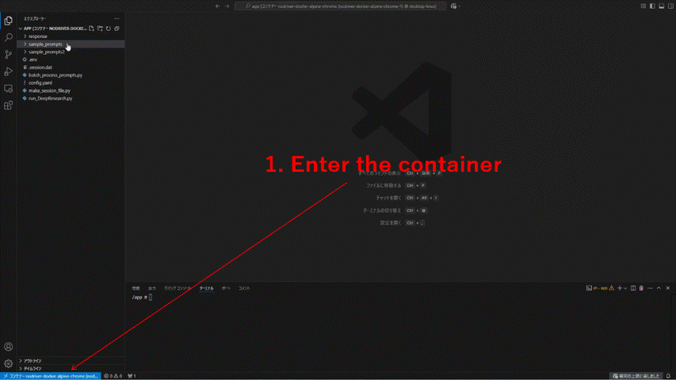

# ChatGPT Deep Research Automator 🤖🔍


[](README.md)
[](README_ja.md)
[](README_zh.md)

## Overview ✨

This repository automates the OpenAI ChatGPT Web UI, allowing you to use the Deep Research feature programmatically. 🎯

### Key Features 🌟

* 🤖 **ChatGPT Web UI Automation** - Easily use Deep Research features through your code
* 🐳 **Docker Environment** - No complicated setup required!
* 👁️ **VNC Monitoring** - Watch the automation in action in real-time (`localhost:5900`, password: `1234`)

## Demo Video 📹



Watch an example of batch processing in action:

[Batch Processing Demo](https://www.youtube.com/watch?v=jU_ZSkuf2ZE)

## Setup 🛠️

Simple 3-step setup:

```bash
# 1. Clone the repository
git clone <repository-url>

# 2. Build the Docker image
docker compose build

# 3. Launch
docker compose up
```

## Initial Configuration 🔑

One-time setup to access ChatGPT Web UI:

1. 📂 Access the Docker container and navigate to the `/app` directory
2. 📝 Create an `.env` file with your authentication details:
   ```
   MAIL="your-email@example.com"
   PASSWORD="your-password"
   ```
3. 🔄 Run `python make_session_file.py`
4. ⏳ Wait for the `.session.dat` file to be generated
5. 👁️ You can monitor the process using a VNC viewer (`localhost:5900`)

## Usage 🚀

### 1. Process a Single Prompt 📄

```bash
python run_DeepResearch.py --prompt_path <path_to_prompt_file> [--output_dir <output_directory>]
```

* `--prompt_path`: Path to the prompt file for Deep Research
* `--output_dir`: Directory to save results (default: `/app/response`)

### 2. Batch Processing 📚

```bash
python batch_process_prompts.py --prompt_dir <prompt_directory> [--output_base_dir <output_base_directory>] [--max-workers <number_of_parallel_processes>]
```

* `--prompt_dir`: Directory containing prompt files
* `--output_base_dir`: Base directory to save results
* `--max-workers`: Maximum number of concurrent processes

## Output Format 📊

Results are saved in:
* ✅ HTML format - Visually formatted results
* ✅ Markdown format - Text-based results

---

🔍 **Dramatically improve your research efficiency with automated Deep Research!** 🚀

## Language Options

* [日本語 README](README_ja.md)
* [中文 README](README_zh.md)
* English (current)