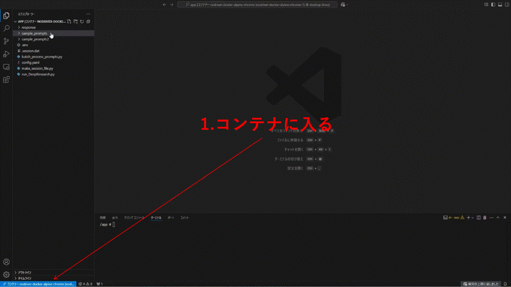

# ChatGPT Deep Research Automator 🤖🔍


[](README.md)
[](README_ja.md)
[](README_zh.md)

## 概要 ✨

このリポジトリは、OpenAI ChatGPTのWebUIを自動化し、Deep Research機能をプログラムから利用できるようにしたものです。🎯

### 主な特徴 🌟

* 🤖 **ChatGPT WebUIの自動化** - Deep Research機能をプログラムから簡単に使えます
* 🐳 **Docker環境対応** - 面倒な環境構築が不要です！
* 👁️ **VNC監視機能** - Docker内の自動化の様子をリアルタイムで確認できます（`localhost:5900`、パスワード: `1234`）

## デモ動画 📹



バッチ処理の実行例をご覧ください：

[バッチ処理デモ](https://www.youtube.com/watch?v=jU_ZSkuf2ZE)

## 環境構築 🛠️

シンプル3ステップで準備完了！

```bash
# 1. リポジトリをクローン
git clone <repository-url>

# 2. Dockerイメージをビルド
docker compose build

# 3. 起動
docker compose up
```

## 初期設定 🔑

ChatGPT WebUIにアクセスするための初期設定（最初の1回のみ必要）:

1. 📂 Dockerコンテナ内の`/app`ディレクトリに移動
2. 📝 `.env`ファイルを作成し、以下の形式で認証情報を記入:
   ```
   MAIL="your-email@example.com"
   PASSWORD="your-password"
   ```
3. 🔄 `python make_session_file.py`を実行
4. ⏳ しばらく待つと`.session.dat`ファイルが生成されます
5. 👁️ VNCビューワー（`localhost:5900`）で処理の様子を確認できます

## 使い方 🚀

### 1. 単一プロンプト処理 📄

```bash
python run_DeepResearch.py --prompt_path <プロンプトファイルのパス> [--output_dir <出力ディレクトリ>]
```

* `--prompt_path`: Deep Researchを実行するプロンプトファイルのパス
* `--output_dir`: 結果を保存するディレクトリ（デフォルト: `/app/response`）

### 2. バッチ処理 📚

```bash
python batch_process_prompts.py --prompt_dir <プロンプトディレクトリ> [--output_base_dir <出力ベースディレクトリ>] [--max-workers <並列数>]
```

* `--prompt_dir`: プロンプトファイルが格納されているディレクトリ
* `--output_base_dir`: 結果を保存するディレクトリ
* `--max-workers`: 同時に実行する処理の最大数

## 出力形式 📊

処理結果は以下の形式で保存されます:
* ✅ HTML形式 - 視覚的に整形された結果
* ✅ Markdown形式 - テキストベースの結果

---

🔍 **Deep Researchの自動化でリサーチの効率を劇的に向上させましょう！** 

## 言語オプション

* 日本語 (current)
* [中文 README](README_zh.md)
* [English README](README.md)