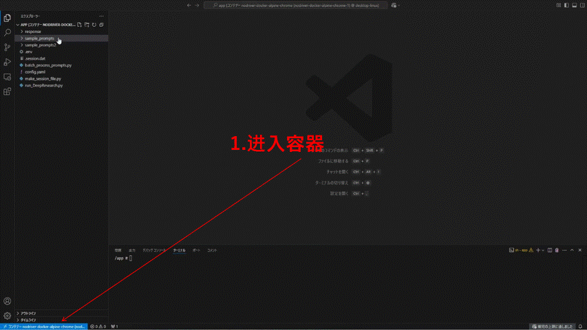

# ChatGPT Deep Research Automator 🤖🔍


[](README.md)
[](README_ja.md)
[](README_zh.md)

## 概述 ✨

本仓库实现了对OpenAI ChatGPT网页界面的自动化，使您能够通过程序使用Deep Research功能。🎯

### 主要特点 🌟

* 🤖 **ChatGPT网页界面自动化** - 轻松通过代码使用Deep Research功能
* 🐳 **Docker环境支持** - 无需复杂的环境配置！
* 👁️ **VNC监控功能** - 实时查看Docker内部自动化过程（`localhost:5900`，密码：`1234`）

## 演示视频 📹



观看批处理运行示例：

[批处理演示](https://www.youtube.com/watch?v=jU_ZSkuf2ZE)

## 环境配置 🛠️

简单三步完成设置：

```bash
# 1. 克隆仓库
git clone <repository-url>

# 2. 构建Docker镜像
docker compose build

# 3. 启动
docker compose up
```

## 初始设置 🔑

访问ChatGPT网页界面的一次性设置：

1. 📂 访问Docker容器并导航至`/app`目录
2. 📝 创建一个`.env`文件，填入您的认证信息：
   ```
   MAIL="your-email@example.com"
   PASSWORD="your-password"
   ```
3. 🔄 运行`python make_session_file.py`
4. ⏳ 等待`.session.dat`文件生成
5. 👁️ 您可以通过VNC查看器（`localhost:5900`）监控该过程

## 使用方法 🚀

### 1. 处理单个提示 📄

```bash
python run_DeepResearch.py --prompt_path <提示文件路径> [--output_dir <输出目录>]
```

* `--prompt_path`：执行Deep Research的提示文件路径
* `--output_dir`：保存结果的目录（默认：`/app/response`）

### 2. 批量处理 📚

```bash
python batch_process_prompts.py --prompt_dir <提示目录> [--output_base_dir <输出基目录>] [--max-workers <并行进程数>]
```

* `--prompt_dir`：包含提示文件的目录
* `--output_base_dir`：保存结果的目录
* `--max-workers`：同时执行的最大进程数

## 输出格式 📊

处理结果保存为以下格式：
* ✅ HTML格式 - 视觉化格式结果
* ✅ Markdown格式 - 文本格式结果

---

🔍 **通过自动化Deep Research显著提高您的研究效率！** 🚀

## 语言选项

* [English README](README.md)
* [日本語 README](README_ja.md)
* 中文 (当前)